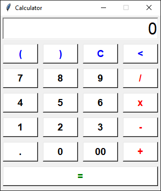

# Simple Calculator

This is a graphical user interface (GUI) calculator built using **Python** and **Tkinter**. The program allows users to perform basic arithmetic operations like addition, subtraction, multiplication, and division. It also provides additional functionality for clearing the display, deleting the last character, and evaluating expressions.

---

## Features
1. **Arithmetic Operations**: Perform operations like addition (+), subtraction (-), multiplication (×), and division (÷).
2. **Display Management**:
   - Clear the display (`C` button).
   - Delete the last character (`<` button).
   - Show current calculations on the display.
3. **Number Entry**:
   - Input single or double-digit numbers (e.g., `0`, `00`).
   - Input decimal points for fractional numbers.
4. **Parentheses Support**: Use parentheses `(` and `)` for complex expressions.
5. **Result Calculation**: Press the `=` button to evaluate and display the result.

---

## Installation
1. Install Python 3.x if it's not already installed.
2. Run the program using the following command:
   ```bash
   python Calculator.py
   ```

---

## How to Use
1. **Start the Program**: Run the `Calculator.py` script.
2. **Enter Numbers and Operators**:
   - Click the numeric buttons (`1`, `2`, ..., `0`) to input numbers.
   - Use the operator buttons (`+`, `-`, `x`, `/`) to select operations.
   - For decimal values, use the `.` button.
3. **Perform Actions**:
   - Use `C` to clear the display.
   - Use `<` to delete the last character.
   - Press `=` to calculate the result.
4. **Exit the Program**: Close the calculator window.

---

## Code Structure
1. **Main Window**: 
   - The main window (`root`) is created using Tkinter.
   - It includes a centered layout for better user experience.
2. **Display**:
   - A text entry widget (`tk.Entry`) is used to display calculations and results.
3. **Buttons**:
   - Buttons are dynamically created and placed using a grid layout.
   - Commands are associated with buttons to handle click events.
4. **Functions**:
   - `add_to_display(value)`: Adds the clicked button's value to the display.
   - `clear_display()`: Clears the entire display.
   - `delete_last()`: Deletes the last character in the display.
   - `calculate_result()`: Evaluates the current expression and displays the result.

---

## Example Layout
- **Display Area**: At the top, showing the calculation or result.
- **Buttons**:
  ```
  (  )  C  <
  7  8  9  ÷
  4  5  6  ×
  1  2  3  −
  .  0  00 +
  = (spanning entire row)
  ```

---

## Future Improvements
- Add more advanced mathematical functions (e.g., square root, exponents).
- Enhance the user interface with custom styles or themes.
- Add keyboard support for faster input.

---

## Screenshots
A screenshot of the calculator running.

---

## License
This project is licensed under the MIT License.
